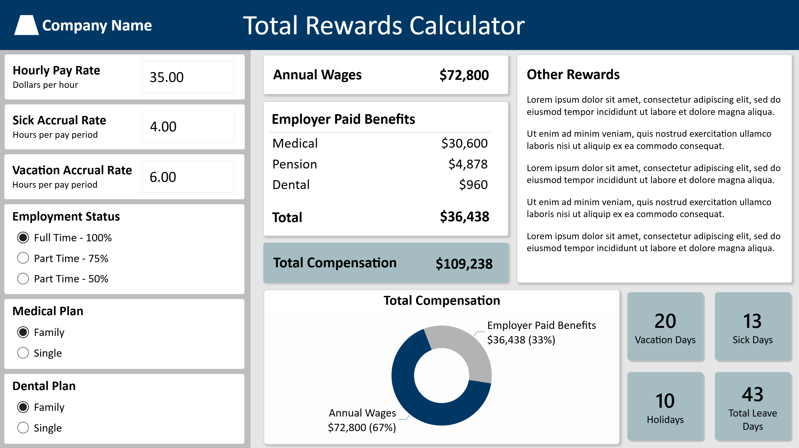

## About

This is an example Power BI report that calculates annual wages, employer paid benefits, total compensation, and leave days based on user inputs. It is modeled off a real project request I completed while partnering with a human resources team. Only a screenshot of the report is available at this time.

{fig-align="center" width="100%"}
